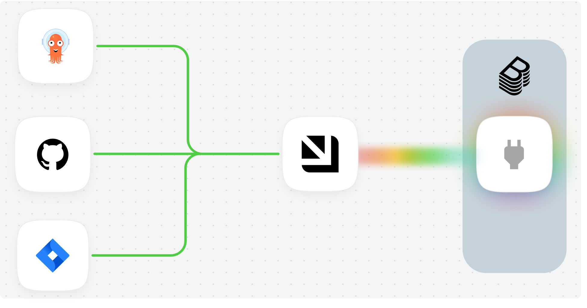
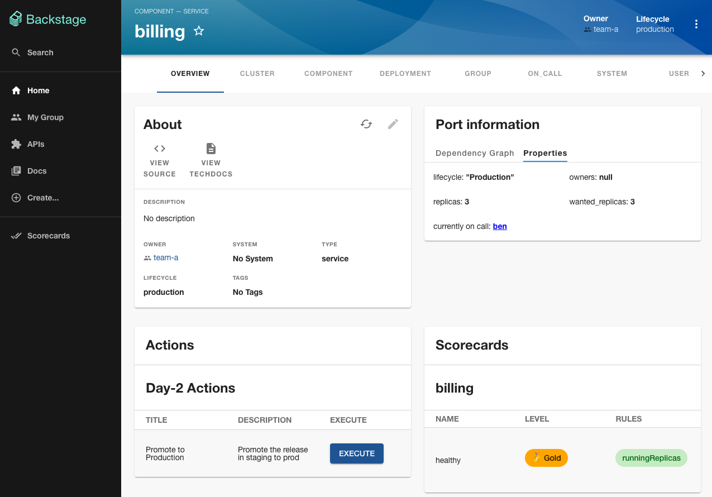
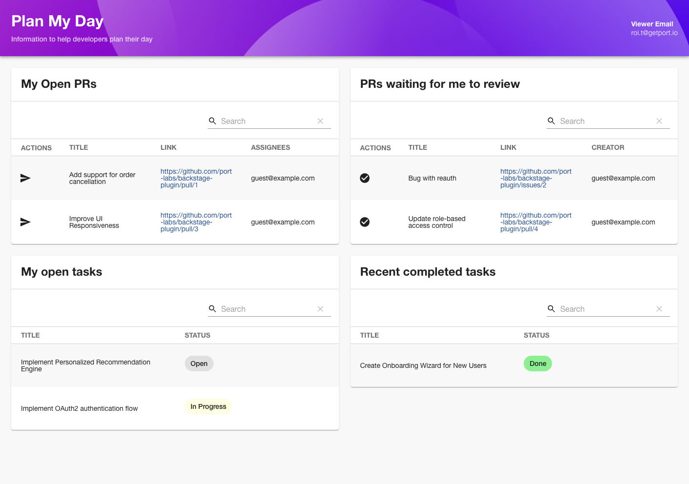
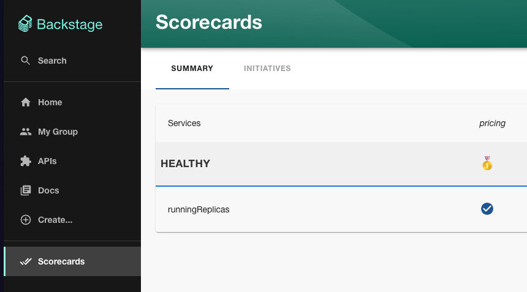

# Backstage Plugin Framework by Port

The **Backstage Plugin Framework** by [Port](https://backstage-plugin.getport.io) will help you build plugins for your Backstage instance faster.

We are also providing a few enterprise-ready example plugins to help you get started.

Building a developer portal from scratch can be a daunting task, but with the **Backstage Plugin Framework** by [Port](https://backstage-plugin.getport.io), you can have a **fully functional portal in days not months**.

  

With this framework, you can:

- Build a new plugin with the framework in days and not months
- Use our enterprise-ready [out-of-the-box plugins](https://docs.backstage-plugin.getport.io/examples) to get started faster
- Integrate with 50+ tools and services through Port's extensive integration library
- Use our rules engine to build scorecards which promote standards across your software catalog

---

## Official Documentation

Please refer to our [docs](https://docs.backstage-plugin.getport.io) for installation, usage, customization and tips.

## Screenshots

1. Service view - Added scorecards, actions, and information from integrations.

2. Dev Daily plugin

3. Scorecards view

---

## Getting Started

> [!WARNING]\
> The Backstage plugin framework by Port is currently in beta and may not be fully stable. Please report any issues or suggestions through our GitHub repository.

To start using the Backstage Plugin Framework by Port, see the [Getting Started](https://docs.backstage-plugin.getport.io/getting-started) documentation.

## Pricing

The Backstage Plugin Framework by Port has a free forever plan and a paid plan for enterprise use.
Visit [Port Pricing](https://backstage-plugin.getport.io/pricing) for more information.

## Support

If you encounter any issues or have questions, please file an issue on the GitHub repository or contact Port Labs support.
