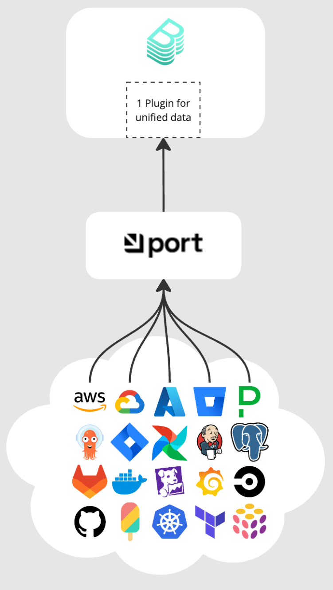

<p align="center">

</p>

# Port Backstage Plugin

The Port Backstage plugin allows you to use **one plugin** for all your data sources into your Backstage instance.

No more wrestling with endless plugin setups, constant upgrades, and cluttered dashboards that slow you as a portal builder and your developers down.

> [!NOTE]
> This is designed to enhance your Backstage setup, helping you build a better portal more efficiently—not to replace your existing Backstage plugins or Backstage itself.

---

## Screenshots

1. Service view - Added scorecards, actions, and information from integrations.
<p align="center">


</p>

2. Scorecards view
<p align="center">

</p>

---

With Port's data modeling, you can shape and trim data to focus only on what matters.

[Model your data in Port](https://docs.getport.io/build-your-software-catalog/customize-integrations/configure-data-model/)

<p align="center">

</p>

Integrate your portal with data sources like Jira, PagerDuty, Snyk, AWS, and more in minutes, not months.

[Integrate in minutes, not months](https://docs.getport.io/build-your-software-catalog/sync-data-to-catalog/)

Backstage plugin development often lags behind the needs of modern teams, turning what should be a powerful portal into a messy data dump. Port's plugin changes that by letting you manage everything through a single, flexible plugin.
Cutting setup and build time from months to days.

For up to 15 users you can use the free open source version of the plugin and create an account in Port.

For more than 15 users you need to get a license from [Port](https://backstage-plugin.getport.io/).

## Getting Started

> [!WARNING]\
> The Port Backstage plugins are currently in beta and may not be fully stable. Please report any issues or suggestions through our GitHub repository.

1. **Create a Port Account**

   - Visit [Port's website](https://www.getport.io) to create your free account
   - Follow the onboarding process to set up your organization
   - For up to 15 users, you can use the free version.

2. **Configure Port Credentials**

   - In Port, on the top right, click on the three dots and select **Credentials**
   - Generate API credentials (Client ID and Client Secret)
   - Add these credentials to your Backstage's `app-config.yaml`:
     ```yaml
     port:
       api:
         baseUrl: https://api.getport.io
         auth:
           clientId: YOUR_CLIENT_ID
           clientSecret: YOUR_CLIENT_SECRET
     ```
   - [Find your Port credentials](https://docs.getport.io/build-your-software-catalog/custom-integration/api/#find-your-port-credentials)

3. **Install the Backend and Frontend Plugins**

   Install both plugins using yarn:

   ```bash
   # Install backend plugin
   yarn add --cwd packages/backend @port-labs/backstage-plugin-port-backend

   # Install frontend plugin
   yarn add --cwd packages/app @port-labs/backstage-plugin-port-frontend
   ```

   Then register the backend plugin in `packages/backend/src/index.ts`:

   ```typescript
   backend.add(import("@port-labs/backstage-plugin-port-backend"));
   ```

   Finally, add components as you like from the frontend plugin to your Backstage instance.

   For example, let's add the Scorecard component to the NavBar:

   in the file: `packages/app/src/App.tsx`, add the route:

   ```typescript
   <Route path="/scorecards" element={<ScorecardsPage />} />
   ```

   and then add the link to the NavBar, in the file: `packages/app/src/components/Root/Root.tsx`:

   ```typescript
   <SidebarItem icon={DoneAllIcon} to="scorecards" text="Scorecards" />
   ```

   

4. **Explore Port's API Integration**
   - Review the frontend plugin documentation for examples
   - Use Port's API to fetch and display data in your Backstage instance
   - Leverage Port's data models to customize your views
   - Check out our [API documentation](https://docs.getport.io/api-reference/port-api) for more details

## Repository Structure

The repo is organized into two main packages:

1. `backend-plugin`: Contains the backend implementation of the Port Backstage plugin.
2. `frontend-plugin`: Contains the frontend inspiration for what you can build with the Port Backstage plugin, but you can and **should** build your own components.

## Development

To integrate the Port Backstage plugins into your Backstage deployment, follow these steps:

1. Install the backend and frontend plugins:

   ```bash
   # In your Backstage root directory
   yarn add --cwd packages/backend @port-labs/backstage-plugin-port-backend
   yarn add --cwd packages/app @port-labs/backstage-plugin-frontend-port
   ```

2. Configure the `app-config.yaml` file:

   Add the following configuration to your `app-config.yaml`:

   ```yaml
   port:
     api:
       baseUrl: https://api.getport.io # Replace with your Port API base URL if different
       auth:
         clientId: YOUR_CLIENT_ID
         clientSecret: YOUR_CLIENT_SECRET
   ```

   Replace `YOUR_CLIENT_ID` and `YOUR_CLIENT_SECRET` with the actual credentials provided by Port.

3. Follow the specific setup instructions in the README files of the backend and frontend plugins for additional configuration steps.

Please refer to the individual README files in each plugin directory for specific instructions on how to develop, build, and test each plugin.

## Support

If you encounter any issues or have questions, please file an issue on the GitHub repository or contact Port Labs support.
